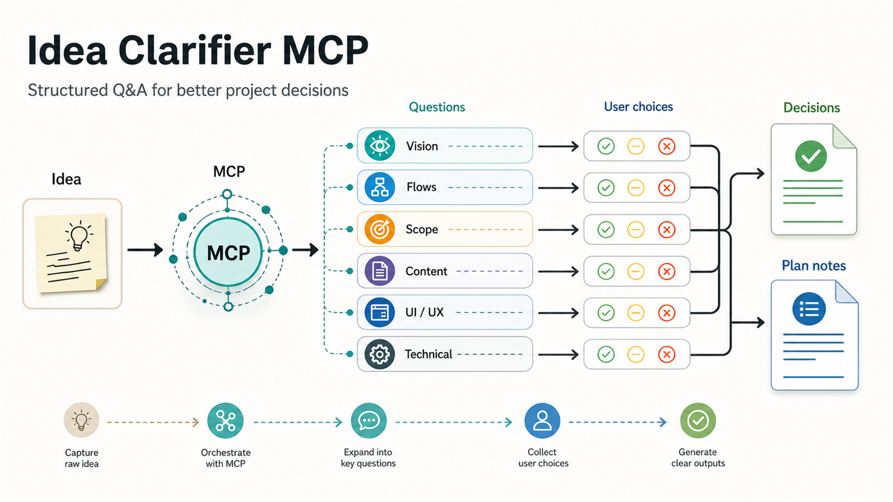
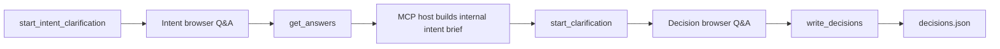

# Idea Clarifier MCP



Idea Clarifier MCP turns an unclear product idea or a pending implementation plan into a structured decision session. New project ideas use an intent-first flow: the user first answers a short fixed set of option-based intent questions, optionally adding custom answers, then the MCP host prepares targeted product and technical questions from those answers. The server writes final decisions back into the target project as JSON.

## What It Does

- Opens a browser-based Q&A session from an MCP tool call.
- Supports intent-first deep clarification for new project ideas and shorter pre-plan clarification for existing projects.
- Keeps temporary session state in the target project for crash recovery.
- Returns unresolved and AI-delegated decisions to the MCP host before final output is written.
- Produces structured JSON that can feed planning, scoping, architecture, and implementation work.

## Flow



## Tool Surface

| Tool | Use case | Output |
| --- | --- | --- |
| `start_intent_clarification` | Required first step for a new project idea | Starts a fixed option-based intent browser session |
| `start_clarification` | Second-stage new project clarification with categorized questions | Starts a browser session |
| `start_plan_clarification` | Focused clarification before planning changes in an existing project | Starts a browser session |
| `get_answers` | Reads submitted answers after the user says they are done | Answers, undecided items, and AI decision requests |
| `write_decisions` | Finalizes a completed session | `decisions.json` or `plan_notes.json` |

## Outputs

New-project clarification writes `decisions.json` grouped by question category:

```json
{
  "project_idea": "A short project idea",
  "generated_at": "2026-05-22T12:00:00",
  "decisions": {
    "project_vision": [
      {
        "question": "Who is this for?",
        "answer": "Small teams",
        "ai_decided": false,
        "user_custom": false,
        "undecided": false
      }
    ]
  }
}
```

Pre-plan clarification writes `plan_notes.json` as a flat list of notes:

```json
{
  "planning_context": "Add an export flow to the existing service",
  "generated_at": "2026-05-22T12:00:00",
  "notes": [
    {
      "question": "Which export format is required first?",
      "answer": "CSV",
      "ai_decided": false,
      "user_custom": false,
      "undecided": false
    }
  ]
}
```

The server also stores a temporary `.clarifier/session.json` file under the target project while a session is active. `write_decisions` removes that temporary session file after finalization.

## Requirements

- Python 3.11 or newer
- An MCP host that can launch stdio servers
- A browser available on the machine running the server

The project uses `uv.lock`, so `uv` is the shortest setup path.

## Install

```powershell
uv sync
```

## Run

Start the stdio MCP server from the repository root:

```powershell
uv run idea-clarifier
```

For an MCP host configuration, point the host at the same command and repository directory. Adapt the JSON shape to the host you use:

```json
{
  "mcpServers": {
    "idea-clarifier": {
      "command": "uv",
      "args": [
        "--directory",
        "C:/absolute/path/to/idea-clarifier-mcp",
        "run",
        "idea-clarifier"
      ]
    }
  }
}
```

## Session Contract

For new project ideas, call `start_intent_clarification(idea, project_path)` first. It opens a fixed seven-question, option-based intent session and writes no output files. The user can add a custom answer alongside selected options. After the user submits, call `get_answers(session_id)` once, use the raw answers to build an internal intent brief, then generate the second-stage questions.

`start_clarification` expects an `idea`, a `project_path`, and a non-empty list of questions. Each new-project question carries:

- A unique `id`
- A `category`
- An explicit `type` for choice questions: `single_choice` when only one answer should win, `multi_choice` when multiple answers can be valid
- A user-facing `question`
- One unique `decision_axis` concept managed by the agent; do not ask the same decision twice with different wording
- 2-5 `options` for choice questions
- Optional `option_descriptions`, one per option when provided

`start_plan_clarification` uses the same four-option pattern without categories and is intended for a smaller set of targeted questions.

After a decision browser session is submitted:

1. Wait until the user says they submitted the browser form, then call `get_answers(session_id)` once. Use `wait_seconds` for one long-poll call if needed.
2. Discuss any `undecided_questions` with the user in the MCP host.
3. Fill `ai_decisions` for questions delegated to the AI host.
4. Call `write_decisions(session_id, ai_decisions)`.

## Project Layout

```text
src/idea_clarifier/server.py       MCP tools and session finalization
src/idea_clarifier/daemon.py       FastAPI daemon for the local Q&A UI
src/idea_clarifier/static/index.html
                                   Browser session interface
AGENT_GUIDE.md                     Detailed question-writing guidance
```

## Notes

- The HTTP daemon listens on `127.0.0.1:7532` when a clarification session starts.
- Session data is held in memory while the server is running; the temporary session file is for recovery context, not a standalone resume API.
- The bundled browser interface is currently Turkish, while this README and the generated project overview asset are English.

## Using with Hermes Agent

Idea Clarifier works as a stdio MCP server with Hermes Agent.

### Installation

```powershell
uv sync
```

### Adding to Hermes Config

Add the following block to your `~/.hermes/config.yaml`:

```yaml
mcp_servers:
  idea-clarifier:
    command: uv
    args:
      - --directory
      - C:/absolute/path/to/idea-clarifier-mcp
      - run
      - idea-clarifier
    enabled: true
    timeout: 300
```

After restarting Hermes, it should appear when you run `hermes mcp list`.

**Important:** You must also install Hermes's MCP client support:

```bash
pip install 'hermes-agent[mcp]'
```

Or the full installation:

```bash
pip install 'hermes-agent[all]'
```

Skipping this step may cause Hermes to return the error "mcp Python SDK not installed".
